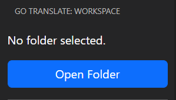
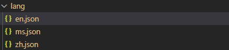
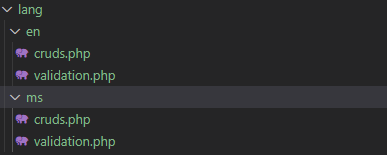
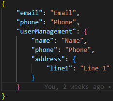
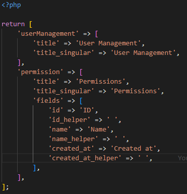
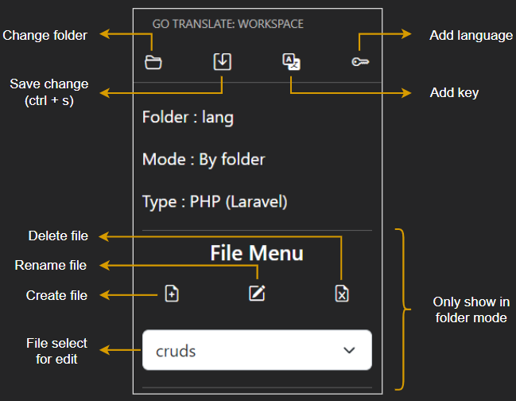
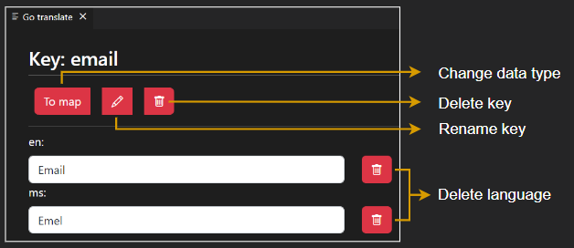

# Description

This is a tools for easy to write different language constant

# Read me

This is the folder to choose to store your language constants.

1. Output mode
    * Light mode
        * 
    * By folder mode
        * 

2. Output file type
- This is to choose your file extension. (Example: .php, .json, .arb file)

    * .json, arb
        * 
    * .php
        * 

